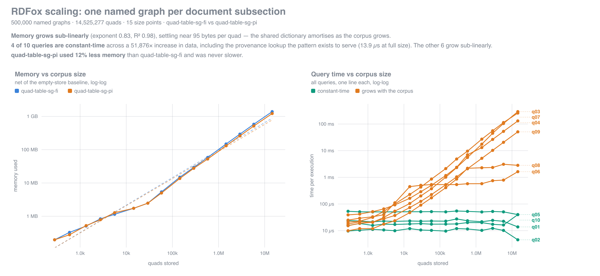

# Named-graph provenance stress test for triplestores

How does a triplestore hold up when provenance is modelled as **one named graph
per document subsection**, with the graph URI itself described in the default
graph? That pattern is expressive but multiplies named graphs alarmingly — one
per subsection rather than one per document — and it is not obvious what that
costs in memory or query time until you measure it.

This generates a synthetic corpus in that shape at controlled sizes, loads it at
increasing scales, and records memory and query time at each point.

Python 3.10+ standard library only — the generator, the measurement harness and
the HTML report have no dependencies. `validate_dataset.py` optionally uses
`rdflib`.

| File | | Store-specific? |
| --- | --- | --- |
| `generate_dataset.py` | builds the synthetic corpus | no |
| `measure.py` | loads it at increasing sizes, records memory and query time | **yes** — drives RDFox |
| `report.py` | renders `results.json` as a self-contained HTML report | no |
| `validate_dataset.py` | checks a dataset before spending benchmark time on it | no |
| `queries/` | the ten SPARQL queries, as used for the published results | no |

**Portability.** The corpus is plain TriG (or N-Quads) and the ten queries are
plain SPARQL 1.1, so the dataset and query set load into any store with named
graph support — nothing in either is RDFox-specific. The harness is the part
that is: it drives the RDFox shell and parses its output. Pointing this at
another triplestore means writing a new driver against the same contract, which
is small — see [Testing another store](#testing-another-store).

So far only RDFox 7.6 has been measured; every number below is from it.

## Results at a glance — RDFox 7.6

500,000 named graphs / 14,525,277 quads, 15 size points, both storage types.



- **Memory grows sub-linearly** (exponent 0.83, R² 0.98) and settles near
  **95 bytes per quad** — the shared dictionary amortises as entities recur
  across graphs.
- **4 of 10 queries are constant-time**, unchanged across a 51,876× increase in
  data, including the point lookup the whole pattern exists to serve
  (**13.9 µs** at 14.5M quads). The other six grow, but all sub-linearly.
- **`quad-table-sg-pi` used 12% less memory** than `-fi` and was never slower —
  1.9× faster on the graph-keyed fan-out query.

One store, one machine, one seed, one dataset shape. Details and caveats below.

### Reading the full report

GitHub renders a committed `.html` as **source**, not as a page, so
`results/report.html` will not display in the repo view — which is why the
summary above is a committed PNG. For the full interactive report (13 charts,
per-query panels, every datapoint), clone and open it:

```bash
git clone git@github.com:Ortecha/triplestore-prov-test.git
open triplestore-prov-test/results/report.html
```

It is a single self-contained file with no external requests, so it works
straight off disk.

`report.py` regenerates the summary image on every run, in three forms:

| File | |
| --- | --- |
| `results/summary-dark.png` | transparent background — the one embedded above, so it reads on GitHub's light *and* dark themes |
| `results/summary.png` | white background and darker ink, for slides, docs and anywhere transparency is unwelcome |
| `results/summary.svg` | vector source, if you want to rescale or restyle it |

Rasterising needs `rsvg-convert` (librsvg) or ImageMagick on the path; without
one, `report.py` still writes the SVG and says so rather than failing.

## The pattern

Each leaf subsection of a document becomes a named graph holding the triples
extracted from it. The graph URI is a subject in the **default graph**, where it
is linked to its original text, section number and parent section:

```
# default graph — provenance
<…/sec/12/3.2.7>  a                 pv:Subsection ;
                  pv:text           "full text of the subsection …" ;
                  pv:sectionNumber  "3.2.7" ;
                  pv:parentSection  <…/sec/12/3.2> ;
                  pv:document       <…/doc/12> ;
                  pv:title          "…" ;
                  pv:ordinal        7 ;
                  pv:tripleCount    17 .

# named graph — extraction
GRAPH <…/sec/12/3.2.7> {
    <…/e/8123>  a           <…/c/4> ;
                rdfs:label  "Vosen Ridal" ;
                <…/p/3>     <…/e/91> ;
                <…/p/19>    "1974-03-02"^^xsd:date .
}
```

Sections above the leaves (`pv:Section`) and documents (`pv:Document`) are
described in the default graph too, so `pv:parentSection` can be walked all the
way up. Roughly 8 provenance triples per named graph, plus 6 per internal
section and 3 per document.

## Usage

```bash
python3 generate_dataset.py --graphs 100000 --workers 8
```

Writes to `out/`:

| Path | Contents |
| --- | --- |
| `data/part-*.trig.gz` | gzipped TriG, one shard per graph-index range |
| `queries/q01…q10.rq` | SPARQL, pre-bound to constants that really occur |
| `manifest.json` | parameters, per-shard and cumulative counts, checkpoints |

Check the projected size before committing to a big run:

```bash
python3 generate_dataset.py --graphs 10000000 --estimate
```

Throughput is about 1.7M quads/s on 8 workers (~5.8M quads in 3.4s), so even a
100M-quad corpus generates in about a minute.

## How to get a clean scaling curve

This part is store-agnostic — it is a property of how the corpus is cut, not of
any particular engine.

Shards are cut **exactly on log-spaced checkpoints** (10, 20, 50, 100, …) and
graph *i* depends only on `(seed, i)` — never on the total. So a dataset of any
size is a byte-exact prefix of a larger one with the same parameters, and you
can measure every point on the curve inside **one** RDFox process:

```
create the data store with the storage type under test
for k in manifest.checkpoints:
    import shards up to k["shards_to_load"]      # cumulative, no reload
    record RDFox's memory figures
    run each query in queries/, record time
```

Measuring in one process is the point: separate processes per size mostly
measure allocator behaviour and page-cache state, which will swamp the effect
you are looking for. The manifest gives you the x-axis directly — each
checkpoint row carries `graphs`, `quads`, `provenance_quads` and
`content_quads`.

`--checkpoints 1000,10000,100000` overrides the default spacing.

Because the generator emits **no duplicate quads** (verified), RDFox's quad
count after loading should equal `manifest.totals.quads` exactly. If it does
not, that is a real finding, not a generator artefact.

## Running it against RDFox

Everything from here to [Testing another store](#testing-another-store) is
RDFox-specific. Verified against RDFox 7.6 (`RDFox-macOS-arm64-7.6`). Two things
are worth knowing before you start, because both are easy to get wrong:

**`quad-table-sg-fi` is not a data store `type`.** It is the value of the
separate **`quad-table-type`** parameter. The `type` parameter takes
`parallel-nn` / `parallel-nw` / `parallel-ww`, and passing the quad table value
there fails outright:

```
Data store type 'quad-table-sg-fi' is invalid; available data store types are
'parallel-nn', 'parallel-nw', and 'parallel-ww'.
```

The correct form, confirmed by `dstore show`:

```
dstore create bench quad-table-type quad-table-sg-fi
```

The full set of values is `quad-table-{sg,lg}[-fi|-pi]`. `type` is independent
and optional — set it too if you also want to vary the parallel storage layout.

**The data must be TriG, not N-Quads** — which is why this generator emits
`.trig.gz`. RDFox's shell `import` picks its parser from the file extension and
recognises only `.ttl`, `.trig` and `.dlog`. An `.nq` file is parsed as Turtle,
so every quad fails on its fourth term (`';' or '.' expected`) — with a
per-line error, not a single obvious one. N-Quads *is* supported, but only as
the `application/n-quads` media type over the REST endpoint, which is what
`--format nquads` is there for. Gzip is handled transparently for both.

The REST path is verified working — against a `daemon` on port 12110:

```bash
curl -u "$RDFOX_ROLE:$RDFOX_PASSWORD" -X POST "http://localhost:12110/datastores/bench?quad-table-type=quad-table-sg-fi"
curl -u "$RDFOX_ROLE:$RDFOX_PASSWORD" -X POST "http://localhost:12110/datastores/bench/content" \
     -H "Content-Type: application/n-quads" --data-binary @part-00000.nq
```

Note the storage type is a **query parameter** on store creation there. This is
the one route that takes N-Quads, and it sidesteps the sandbox-directory
restriction entirely since the data goes over the wire rather than being read
from a path.

A run against a live instance:

```bash
cd /path/to/RDFox-macOS-arm64-7.6
./RDFox sandbox . \
  "dstore create bench quad-table-type quad-table-sg-fi" \
  "active bench" \
  "set output null" \
  "import /path/to/out/data/part-00000.trig.gz" \
  "info" \
  "answer /path/to/out/queries/q03_graphs_mentioning_hub_entity.rq"
```

- `import` accepts `*` globs, so a checkpoint is `import .../part-0000{0,1,2}.trig.gz`
  or an explicit list of the first *k* shards from the manifest.
- `info` reports **`Aggregate memory consumed (bytes)`** and
  `Aggregate number of explicit facts` — the two numbers the study needs.
  `maxmemory` with no argument prints server-wide usage.
- `answer <file>` runs a `.rq` file and prints
  `Total statement evaluation time`. `set output null` discards result rows so
  you time evaluation rather than formatting.
### Which mode: `sandbox`, `shell`, or `daemon`

`sandbox` is throwaway — it sets no server directory, so **nothing survives the
process**, and it also disables filesystem sandboxing, which is why it imports
from any absolute path without further setup. For a scaling run that is usually
what you want: each measurement should start from a cold, empty store anyway.

`shell` and `daemon` use a server directory and can persist, but two things
bite:

1. **Filesystem sandboxing is on.** `import` of a path outside the sandbox
   fails with `Path '...' is not within the sandbox path.` Pass
   `-sandbox-directory <dir>` covering your data (or `""` to disable).
2. **`-persistence file-sequence` may not be covered by your licence** —
   `The active license does not support the 'file-sequence-persistence' feature.`
   `-persistence file` worked on the licence used here.

Initialising a persistent server (first role is created at init). This is the
form already used for the instance at `~/.RDFox`:

```bash
./RDFox -persistence file -role <role> -password <password> -channel unsecure init
```

Its `server.params` ends up holding `persistence file` and `endpoint.params`
`channel unsecure`. Note that `sandbox-directory` is *not* recorded there, so it
has to be passed on each invocation:

```bash
./RDFox -sandbox-directory /path/to/data shell .
```

### OpenSSL, and why `DYLD_LIBRARY_PATH` is the wrong lever here

RDFox `dlopen`s `libssl.3.dylib` / `libcrypto.3.dylib` at runtime rather than
linking them, so `otool -L` shows nothing and a missing OpenSSL only surfaces
when something actually needs it. The usual fix is:

```bash
export DYLD_LIBRARY_PATH="/opt/homebrew/opt/openssl@3/lib:$DYLD_LIBRARY_PATH"
```

That works, but it redirects dylib resolution for the **whole process**, not
just OpenSSL — it can quietly shadow other libraries the benchmark depends on
(zlib for the gzipped import, the allocator), which is an uncontrolled variable
in exactly the measurements being collected. RDFox reads two targeted variables
instead, which is the better choice for a benchmark:

```bash
export RDFOX_LIBSSL_PATH=/opt/homebrew/opt/openssl@3/lib/libssl.3.dylib
export RDFOX_LIBCRYPTO_PATH=/opt/homebrew/opt/openssl@3/lib/libcrypto.3.dylib
```

Verified: a full persistent-server run with these set and `DYLD_LIBRARY_PATH`
unset reports the same 151,994,368 bytes as every other fresh import.

RDFox also reads `RDFOX_ROLE` and `RDFOX_PASSWORD`, which keeps credentials out
of the command line — worth using, since a password passed as `-password` is
visible to any `ps` on the machine.

### Don't benchmark inside `~/.RDFox`

If that server already holds other data stores, a `daemon` loads all of them
into RAM at startup.
`info` is per-data-store so its figures stay clean, but anything server-wide
(`maxmemory`, RSS) would include them, and a benchmark store created there
persists to disk alongside real work. Use a throwaway
`-server-directory`, or plain `sandbox` mode.

There is no `persistent` parameter on `dstore create` — persistence comes from
the server-level setting, and `dstore show` then reports `Persistent: yes`.

**Persistence does not change what you are measuring.** Same 1.45M quads,
`quad-table-sg-fi`, memory reported by `info`:

| | Aggregate memory | Note |
| --- | --- | --- |
| Fresh import, `sandbox` | 151,994,368 | |
| Fresh import, persistent server | 151,994,368 | byte-identical |
| After restart, restored from disk | 150,765,568 | −0.8% |
| After `dstore load` from a `.bin` | 150,274,048 | −1.1% |

RDFox is RAM-resident either way; persistence adds a disk write, not a different
in-memory layout. But note the bottom two rows: **a restored store measures
about 1% smaller than a freshly imported one**, so keep the harness consistent —
measure every point after a fresh import, or every point after a restore, never
a mix. A 1% artefact is small, but so are some of the differences you are
looking for.

If you want to avoid reloading a large corpus repeatedly, `dstore save <name>
<file>` / `dstore load <name> <file>` works **without** the persistence licence,
in plain `sandbox` mode, and preserves `quad-table-type`. For the 1.45M-quad set
that was a 92 MB binary loading in 0.74 s against 1.14 s to re-import the TriG.

Verified end to end on 50,000 graphs / 1,453,641 quads — RDFox reported exactly
the manifest's quad count under both storage types, and all ten queries returned
rows:

| | `quad-table-sg-fi` | `quad-table-sg-pi` |
| --- | --- | --- |
| Aggregate memory | 151.9 MB | 135.2 MB |
| Import time | 1.29 s | 0.97 s |
| Explicit facts | 1,453,641 | 1,453,641 |

That single point is only a smoke test, not a result — it is one size, one seed,
and a cold cache. It does confirm the pipeline measures what it should.

One caveat about this machine: RDFox prints a startup warning that only ~0.5 GB
appears available. On macOS that counts free pages only; ~24 GB was actually
reclaimable (inactive + purgeable). Don't size the experiment off that warning,
but do close the browser before a large run — RDFox is RAM-resident and a real
shortfall would distort exactly the numbers you are collecting.

## The measurement harness (RDFox)

This is the one store-specific component. What it does is generic; how it talks
to the store is not.

```bash
python3 generate_dataset.py --graphs 500000 --workers 8 --out data500
python3 measure.py --data data500 --rdfox /path/to/RDFox-macOS-arm64-7.6
```

Writes `results/results.json` (every raw reading) and `results/report.html` (a
self-contained report — inline SVG charts, no assets, no CDN, no build step).
Re-render without re-measuring:

```bash
python3 report.py results/results.json
```

For each storage type it starts **one** RDFox process in `sandbox` mode, imports
shards cumulatively, and stops at every manifest checkpoint to record `info` and
time all ten queries. Useful flags: `--types` (which `quad-table-type` values to
compare), `--target-block` (seconds of repeated work per measurement — higher is
more precise and slower), `--min-graphs` (skip the smallest checkpoints),
`--verbose`.

A 500k-graph / 14.5M-quad sweep across both storage types takes about 55 s.

Three things the harness does deliberately, because each one changes the answer:

- **Subtracts the empty-store baseline.** RDFox holds ~3.7 MB before a single
  quad is loaded. Left in, that fixed cost drags the fitted exponent toward zero
  on any small corpus — the gross figure fits 0.55 (R² 0.88) where the net
  figure fits 0.84 (R² 0.98). The report shows both.
- **Refuses to quote an exponent it cannot support.** A power law through
  scattered points always returns *some* number. Fits below R² 0.75 are reported
  as "no reliable trend" rather than as a value.
- **Times queries itself rather than trusting RDFox's printout.** RDFox reports
  `Total statement evaluation time` to the millisecond, which reads `0.000 s`
  for the point-lookup queries at *every* corpus size — they simply cannot be
  measured that way. Instead each query is repeated with `exec N` and the block
  is timed from outside the process (RDFox flushes stdout per command), then
  divided by N, with the shell's per-statement cost (~30 µs, measured at each
  size with a trivial control query) subtracted. N is chosen per query per size
  to target a fixed amount of work, so a 14 µs lookup is averaged over thousands
  of executions and a 290 ms scan over a few.

  This changed the conclusions, not just the charts. Under millisecond timing
  the scan queries appeared to scale **linearly** (1.07–1.31) because their
  small-size readings were pinned at the resolution floor and excluded from the
  fit. Measured properly they are **sub-linear** (0.65–0.95).

- **Distinguishes "constant" from "no trend".** A near-zero exponent always
  comes with a low R², because there is no trend to explain — that is a result,
  not a failed fit. The report separates the two by spread: small exponent plus
  little variation is reported as *constant*, scattered points as *no reliable
  trend*.

### What the first full run showed — RDFox 7.6

500,000 graphs / 14,525,277 quads, 15 size points:

| | `quad-table-sg-fi` | `quad-table-sg-pi` |
| --- | --- | --- |
| Memory (net of baseline) | 1.29 GiB | 1.13 GiB |
| Bytes per quad | 95.4 | 83.9 |
| Memory scaling exponent | 0.83 (R² 0.981) | 0.81 (R² 0.980) |

- **Memory grows sub-linearly** (exponent ~0.84). Cost per quad falls from ~800
  bytes at the smallest sizes and settles near 95 — the resource dictionary
  amortises as entities and predicates recur across graphs, which is exactly the
  behaviour this pattern needs to be viable.
- **`-pi` was smaller *and* never slower.** 12% less memory, and identical times
  on every query except one.
- **4 of 10 queries are constant-time** — flat across a 51,876× increase in
  data, all under 40 µs at full size. That includes `q01`, the "given a triple,
  recover its subsection" lookup the whole pattern exists to serve: **13.9 µs**
  at 14.5M quads, statistically unchanged from 24 µs at 280 quads. Provenance
  retrieval does not degrade as the corpus grows, which is the central result.
- **Scan-shaped queries scale sub-linearly**: `q08` 0.65, `q09` 0.77, `q04`
  0.79, `q07` 0.93, `q03` 0.95. Even the full-scan aggregates beat proportional
  growth.
- **`q03` is 1.9× faster on `-pi` than on `-fi`** (154 ms vs 290 ms). The gap
  widens with scale — 1.0× at 581k quads, 1.9× at 14.5M — and reproduced within
  0.3% when the storage types were run in the opposite order, while the other
  queries stayed at 1.00×. `q03` is the graph-keyed fan-out from a bound
  subject, which is worth knowing if that access path matters to you.

Caveats: one store, one machine, one seed, one dataset shape, cold cache, and
`sandbox` mode throughout, so every figure is on the "freshly imported" baseline. Before
drawing conclusions, vary `--seed` and re-run — and treat the single-run numbers
above as a starting point rather than a result.

## Testing another store

Everything except `measure.py` is store-agnostic. To point this at a different
triplestore, replace the driver and keep the contract:

1. **Create an empty store** in the configuration under test, and record its
   memory before loading anything. Subtracting that baseline is what makes the
   scaling exponent describe the data rather than the engine's fixed overhead —
   on a small corpus the gross figure fits an exponent near zero purely because
   the baseline dominates.
2. **Import shards cumulatively** in `manifest.shards` order, stopping at each
   `manifest.checkpoints` entry (`shards_to_load` says how many files in). Do
   not reload between checkpoints, and stay in one process — separate processes
   per size mostly measure allocator state and page cache.
3. **Record memory and the stored quad count** at each checkpoint. The count
   should equal that checkpoint's `quads` exactly, since the generator emits no
   duplicates; a mismatch is a finding worth chasing.
4. **Time each query in `queries/`.** Whatever timer the store exposes is
   probably too coarse for the fast ones — RDFox's reads `0.000 s` for the point
   lookups at *every* size. Repeat each query enough times to make a block
   measurable, time the block externally, divide, and subtract the per-statement
   overhead measured with a trivial control query.
5. **Emit `results.json`.** `report.py` reads exactly five top-level keys:
   `runs`, `fits`, `dataset_config`, `dataset_totals` and
   `target_block_seconds`. A run is
   `{storage_type, baseline_bytes, points: [...]}`, and a point is
   `{graphs, facts, memory_bytes, memory_net_bytes, import_seconds,
   queries: {name: {seconds, answers, repeats}}}`. Copy `dataset_config` and
   `dataset_totals` straight out of the dataset's `manifest.json`, and build
   `fits` with `measure.py:analyse(runs)` — that function and `fit_power_law`
   are plain Python over the structure above and contain nothing store-specific.

Then `python3 report.py results/results.json` gives you the same charts, and
adding the new store's `storage_type` values to a single run makes the report
compare them side by side on one axis.

Two things that are easy to get wrong and are not specific to RDFox: check which
serialisations the store's loader actually accepts (RDFox picks its parser from
the *file extension* and silently misparses `.nq` as Turtle), and check whether
its "memory used" figure is the store's own accounting or the process RSS — they
are not the same number and only the first is comparable across engines.

## Knobs that change what you are measuring

| Flag | Default | Effect on the experiment |
| --- | --- | --- |
| `--graphs` | 10000 | The main scaling variable: named graphs = leaf subsections. |
| `--triples-per-graph` | 20 | Quads per graph. Sweeping this against `--graphs` at constant total quads separates *number of graphs* from *number of triples* — the key confound in this pattern. |
| `--text-chars` | 600 | Mean length of `pv:text`. **`0` omits the property entirely**; running with and without isolates how much memory the long provenance literals cost. |
| `--p-global` / `--p-recent` | 0.25 / 0.45 | Entity reuse across graphs. Higher `--p-global` means the same triple recurs in more graphs, which is exactly what a quad table must store once per graph. |
| `--head-entities` | 10000 | Size of the shared hub pool; with `--head-skew`, controls how hot the hottest entity is (drives q03/q06). |
| `--local-per-graph` | 4 | New entities per graph, so it sets how fast the resource dictionary grows. |
| `--fanout` | `8,6` | Section tree shape, e.g. `5,4,3` for three levels. Sets provenance-hierarchy depth and hence the cost of `pv:parentSection+` walks. |
| `--triples-sigma` | 0.6 | Lognormal spread of graph sizes; `0` makes every graph identical. |
| `--format` | `trig` | `trig` for RDFox's shell `import`; `nquads` for the REST endpoint and other tooling. |

Everything is deterministic given `--seed`, and the full configuration is
recorded in `manifest.json`.

Two runs worth doing early, since they bound the result: `--text-chars 0`
(provenance without text) and `--triples-per-graph 1` (extreme graph-to-triple
ratio, the worst case for per-graph overhead).

## Queries

The ten queries live in [`queries/`](queries/). That committed copy is the exact
set used for the published results above — regenerated from the same seed and
verified to reproduce the same constants — so you can read the SPARQL without
running anything.

They are **not** hand-written per store: `generate_dataset.py` emits a fresh set
alongside every dataset, bound to constants sampled from that data, because a
query on a constant that does not occur returns instantly and measures nothing.
Use the ones your own run produces (`<out>/queries/`); the committed copy is a
reference, and its constants only exist in a 500,000-graph dataset built with
the default seed.

| Query | What it stresses |
| --- | --- |
| `q01_provenance_of_one_triple` | The core access path: one triple → its subsection, text, section number, parent. Point lookup. |
| `q02_contents_of_one_graph` | Bound graph, unbound triple pattern — cheapest graph-keyed access. |
| `q03_graphs_mentioning_hub_entity` | Fan-out from a hot entity across many named graphs, with provenance. |
| `q04_quads_per_document` | Full scan plus `GROUP BY` over the graph→document link. |
| `q05_ancestor_chain` | `pv:parentSection+` walk up the hierarchy. |
| `q06_cross_graph_two_hop` | A join that deliberately crosses a graph boundary. |
| `q07_text_search` | `CONTAINS` over every `pv:text` literal. |
| `q08_class_with_provenance` | Large join between named graphs and the default graph. |
| `q09_total_quads` | Baseline scan speed. |
| `q10_subtree_extraction` | Provenance-driven retrieval: everything under one section. The realistic read pattern. |

`q02`, `q03` and `q10` are the graph-keyed access paths — the ones that exercise
whatever a store does with named graphs, and so the ones to watch when comparing
storage configurations. On RDFox that meant `quad-table-sg-fi` against
`quad-table-sg-pi`. `q04` and `q09` bound the scan cost.

The query set adapts to the configuration: `--text-chars 0` drops `q07` and the
`pv:text` join in `q01`, since the property no longer exists. One caveat worth
knowing before you read a timing: at `--triples-per-graph 1` every graph holds a
single `rdf:type` triple, so no two-hop path exists anywhere in the corpus and
`q06` is legitimately empty — time it on that config and you are measuring the
cost of finding nothing. `validate_dataset.py` reports it as a failure, which is
the signal you want: don't include that number in the comparison.

## Validating a dataset

```bash
pip install rdflib
python3 validate_dataset.py out/
```

Checks N-Quads syntax, that manifest counts match the bytes on disk, that no
quad is emitted twice, that every named graph URI is fully described and every
`pv:parentSection` resolves, that all ten queries parse/execute/return rows,
and that a separately generated smaller dataset really is a byte-identical
prefix. It loads everything into memory, so run it on a few thousand graphs —
that exercises every code path.

## Vocabulary

| Prefix | URI |
| --- | --- |
| `pv:` | `https://rdfox-stress.example.org/prov/` |
| entities | `https://rdfox-stress.example.org/e/{id}` |
| predicates | `https://rdfox-stress.example.org/p/{k}` |
| classes | `https://rdfox-stress.example.org/c/{k}` |
| sections / graphs | `https://rdfox-stress.example.org/sec/{doc}/{1.2.3}` |
| documents | `https://rdfox-stress.example.org/doc/{n}` |

Change the namespace with `--base`. The default still carries the name of the
first store measured; it is only a namespace, but `--base https://example.org/`
gives you a neutral one if that matters for your run.
